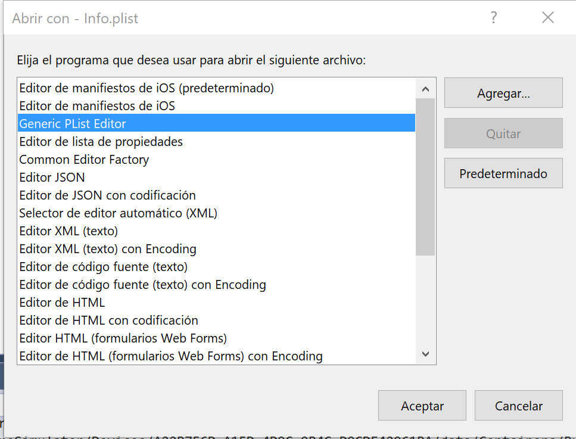
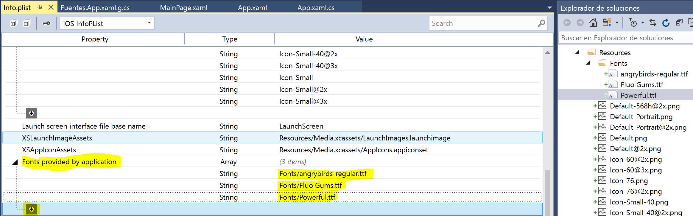
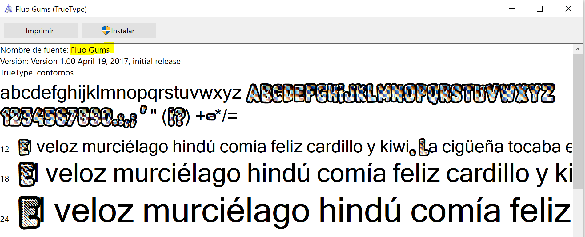

<h1> Agregando fuentes de texto en Xamarin Forms para IOS, Android y UWP </h1>

Vamos a agregar algunas fuentes de texto a nuestro proyecto Xamarin para customizar un poco el diseño.  Aplicaremos la nueva fuente para Android, IOS y UWP.

Lo primero que debemos hacer, es descargar un tipo de fuente. Hay muchas páginas de internet que contiene fuentes de texto que se puede descargar de forma gratuita, en mi caso lo voy a usar <a href="https://www.dafont.com/es/"> dafont.com</a> y voy a descargar la fuente “Monte Cristo” , “Fluo Gums” y “Fluo Gums”.

Una vez descargadas, vamos a configurar en el archivo app.xaml tres estilos, uno para cada fuente.

<code>
        <ResourceDictionary>
            

            

            
        </ResourceDictionary>
</code>

Para usar el estilo lo llamamos así desde nuestra vista con xamarin forms: 

<code>
 <Label Text="Welcome to Xamarin.Forms!" Style="{StaticResource Font-1}" />
</code>

Dondé Font-1 es el valor que hemos creado, en nuestro caso tambien hemos creado Font-2 y Font-3.

Como cada plataforma funciona de una forma distinta, así como la localización del archivo, fue necesario usar OnPlatform para aplicar la configuración de cada plataforma.

En Core la configuración está completa, ahora toca agregar los archivos en plataforma y agregar la configuración. 

<h2>IOS</h2>

Creamos una nueva carpeta dentro de Resources con el nombre de Fonts, ahí dentro debemos agregar nuestros archivos de fuentes.  Fijarte que la acción de compilación sea “BundleResource”.

El próximo paso es abrir al archivo Info.plish con el editor “Generic PList Editor”, para esto seleccionamos el archivo y hacemos clique con el 2º botón del ratón en la opción “abrir con…” en mi caso es la tercera opción.

Una vez abierto tenemos que agregar un nuevo elemento en la lista, hacemos clique en el icono “+” al final de la lista y escribimos “UIAppFonts”.

El próximo paso será escribir el nombre de las fuentes, en este ejemplo voy a agregar 3 tipos de fonts. “Fonts/angrybirds-regular.ttf” , “Fonts/Fluo Gums.ttf”  y “Fonts/Powerful.ttf”. Donde Fonts es el nombre de la carpeta que hemos agregado las fuentes.

<h2>Android</h2>

Para Android tenemos que tener en cuenta 2 cosas:

<ul>
<li>La acción de compilación debe ser AndroidAsset para los archivos de fuentes
</li>
<li>De debe indicar el nombre de la fuente después del nombre del archivo, ejemplo: Fonts/Fluo Gums.ttf#Fluo Gums
</li>
</ul>

Al abrir el archivo de fuente, se puede ver el nombre, en este caso lo he destacado en amarillo. Se debe escribir este nombre tal cual después del nombre del archivo de la fuente usando la “#” antes del nombre. 

<h2>UWP</h2>

<ul>
<li>Para UWP, es muy parecido a Android, se debe indicar el nombre de la fuente después del nombre de archivo, ejemplo: Fonts/Fluo Gums.ttf#Fluo Gums
</li>
<li>La acción de compilación debe ser Contenido para los archivos de fuentes
</li>
</ul>

